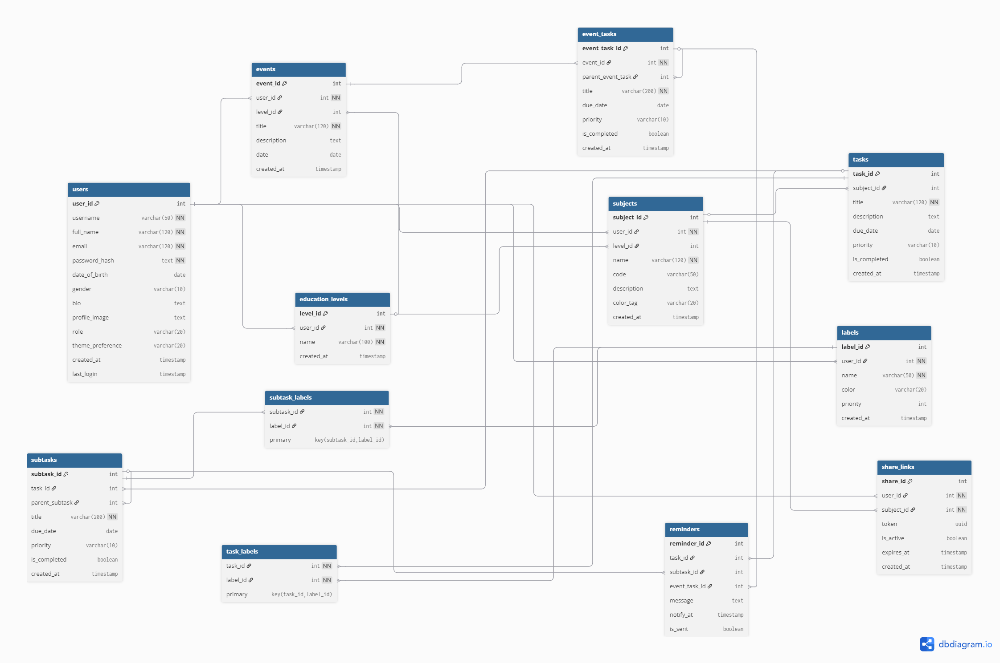

# 🧠 Homework & Task Manager System

ระบบจัดการการบ้านและงานต่าง ๆ แบบครบวงจร  
ผู้ใช้สามารถเพิ่มรายวิชา, เพิ่มงานในแต่ละรายวิชา, ตั้งแจ้งเตือนก่อนถึงกำหนดส่ง  
โดยใช้ **Flask (Python)** เป็น Backend และ **React (Vite + TailwindCSS)** เป็น Frontend  
ทุกอย่างรันผ่าน **Docker Compose**

---

## 🚀 Tech Stack

| ส่วน | เทคโนโลยี |
|------|------------|
| Backend | Flask + SQLAlchemy + Celery + Redis |
| Frontend | React + Vite + TailwindCSS |
| Database | PostgreSQL |
| Task Queue | Celery + Redis |
| Container | Docker + Docker Compose |

---

## ✨ Features
[ดูรายละเอียดฟีเจอร์ทั้งหมด](./docs/Features.md)
---
### ER-Diagram

---
## รันระบบทั้งหมดด้วย Docker
```
docker compose up --build
```

### ระบบจะรันบริการทั้งหมด:
- 🧩 web → Flask backend (port 8000)
- ⚛️ frontend → React app (port 5173)
- 🧠 worker → Celery worker
- ⏰ beat → Celery beat scheduler
- 🐘 db → PostgreSQL
- 🧺 redis → Redis (broker + result backend)

---

## 🧪 API ตัวอย่าง
### 🔹 ทดสอบระบบ
```
GET /api/ping
```

### Response
```
{
  "message": "pong 🏓",
  "status": "ok"
}
```

### 🔹 ตัวอย่าง Task ของ Celery
```
from app.tasks.example_task import test_task
test_task.delay()
```

### ใน worker จะ log ว่า:
```
✅ Celery worker is working correctly!
```
---
## 🐳 Docker Compose Services
| Service    | Description           |
| ---------- | --------------------- |
| `web`      | Flask backend API     |
| `worker`   | Celery worker         |
| `beat`     | Celery beat scheduler |
| `db`       | PostgreSQL database   |
| `redis`    | Redis message broker  |
| `frontend` | React + Vite frontend |

---

## 🧰 Dependencies สำคัญ
### Backend
- Flask
- SQLAlchemy
- Celery
- Redis
- PostgreSQL (psycopg2)
- Flask-Migrate
- Flask-JWT-Extended

### Frontend
- React + Vite
- TailwindCSS
- shadcn/ui (optional)
- Axios
---

### 📝 License
MIT © 2025
Developed by PetchAuisui
